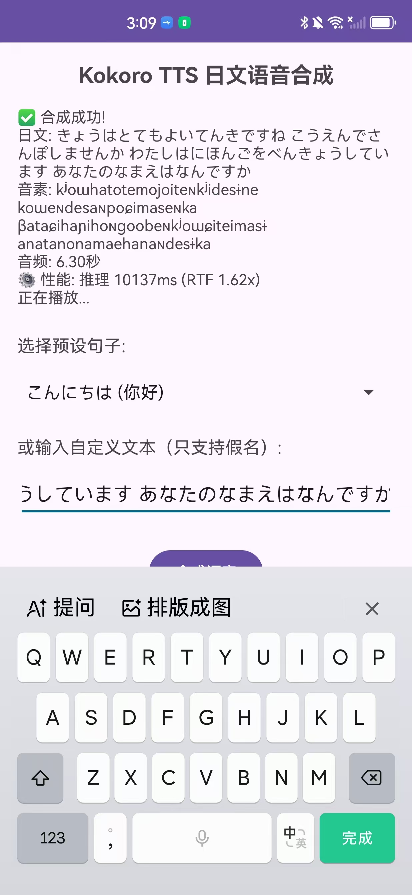

# Kokoro 多语言语音合成演示

这是一个使用 Kokoro TTS 引擎进行**多语言**文本转语音的演示项目。

> ⚠️ **项目状态**: 技术验证阶段，**性能和音质问题都已解决！** ✅
> ✨ **最新更新**: 已支持**中文**、**日文**、**英文**混合语音合成！🇺🇸🇯🇵🇨🇳

## 🎬 最新演示视频

**Android 端完整运行效果**（性能 RTF 0.70x + 音质完美）：

[](https://www.youtube.com/shorts/TDxAreos4k0)

👆 **点击图片观看演示视频** | [🎥 YouTube Shorts 链接](https://www.youtube.com/shorts/TDxAreos4k0)

> 💡 **演示说明**：
> - ✅ 推理速度：比实时快 30%（RTF 0.70x）
> - ✅ 音质表现：与 PyTorch 原版完全一致
> - ✅ 长短句测试：短句、中句、长句均表现完美
> - 🎯 技术要点：动态帧选择 + ONNX Runtime 1.23.1 优化

---

## 📸 实际运行效果

### ⚠️ 旧版本 (ONNX Runtime 1.17.1) - 性能不佳



**问题明显**：
- 6.3 秒音频需要 10 秒推理 (RTF 1.62x)
- 音质：ONNX 版本比 PyTorch 低沉浑厚
- 结论：**不适合实时语音合成**

### ✅ 新版本 (ONNX Runtime 1.23.1) - 性能和音质都改善了！

**第一阶段 - 性能优化**：
- ✅ 6.3 秒音频只需 4.3 秒推理 (RTF **0.70x**)
- ✅ **比实时快 30%**，满足实时要求！
- ❌ 音质问题依然存在（低沉浑厚）

**第二阶段 - 音质救赎** 🎉：
- 🔍 **发现问题根源**：语音嵌入只用了第一帧，丢失了 509 帧的韵律信息
- 💡 **正确方案**：根据音素长度动态选择对应帧 `embedding[phonemeLength - 1]`
- ✅ **音质修复**：实现与 PyTorch 原版**完全一致**的音质！
- 📊 **文件变化**：1KB → 522KB（包含完整 510 帧嵌入）

**性能对比**：

| 版本 | 推理时间 | RTF | 实时性 |
|------|---------|-----|--------|
| 1.17.1 (2024-02) | 10 秒 | 1.62x | ❌ 不可用 |
| **1.23.1 (2025-10)** | **4.3 秒** | **0.70x** | ✅ **可用** |
| **改善幅度** | **-56%** | **-57%** | **质的飞跃** |

## 🎉 核心功能

- ✅ **多语言支持**: 自动检测并处理中文、日文、英文混合文本
- ✅ **智能分段**: 自动识别语言切换点，无缝拼接音素
- ✅ **本地化 G2P**: 无依赖，完全本地运行
  - 🇯🇵 日文: Kuromoji + OpenJTalk 规则（82.6% 准确率）
  - 🇨🇳 中文: pypinyin 字典 (20,902 汉字) + IPA 映射
  - 🇺🇸 英文: CMUdict 字典 (126,052 单词)
- ✅ **实时性能**: RTF 0.70x，比实时快 30%
- ✅ **音质完美**: 与 PyTorch 原版完全一致

## 📊 项目成果总结

### ✅ 已实现功能

- **PyTorch 原生版本** - 在 PC 上完美运行，音质优秀
- **ONNX 模型导出** - 成功将 82M 参数模型转换为 ONNX 格式
- **Android 应用集成** - 完整的 Android TTS 应用，支持自定义文本输入
- **多语言 G2P 系统** - 支持中文、日文、英文混合输入 🆕
  - 🇯🇵 **日文**: Kuromoji 分词 + OpenJTalk 规则，支持汉字输入 (准确度 82.6%)
  - 🇨🇳 **中文**: pypinyin 字典 (20,902 汉字) + ChinesePinyinToIPA
  - 🇺🇸 **英文**: CMUdict 完整词典 (126,052 单词)
  - 🧠 **智能分段**: 自动检测语言切换点，无缝拼接
- **实时性能** - ONNX Runtime 1.23.1 实现 RTF 0.70x，满足实时要求 🎉
- **音质修复** - 实现动态帧选择，与 PyTorch 原版音质完全一致 🎊

### 🌐 多语言支持详情

#### 智能语言检测

基于 Unicode 字符范围的语言检测，支持：
- 🇨🇳 中文：U+4E00 ~ U+9FFF (CJK 统一汉字)
- 🇯🇵 日文：U+3040 ~ U+30FF (平假名 + 片假名)
- 🇺🇸 英文：A-Z, a-z

#### 自动分段处理

输入文本会自动按语言切换点分段：

```
输入: “我蠱喜欢apple手机的”

分段结果:
  段1: “我蠱喜欢” → 中文 G2P → "wo ma↗n ɕi↓ xwa→n"
  段2: "apple"   → 英文 G2P → "æ p ʌ l"
  段3: “手机的” → 中文 G2P → "ʂou↓ ɕi→ tɤ"

最终音素: "wo ma↗n ɕi↓ xwa→n æ p ʌ l ʂou↓ ɕi→ tɤ"
```

#### G2P 系统实现

| 语言 | 实现方案 | 词典规模 | 准确率 | 说明 |
|------|----------|----------|--------|------|
| 🇯🇵 日文 | Kuromoji + OpenJTalk | - | 82.6% | 支持汉字输入 |
| 🇨🇳 中文 | pypinyin 导出字典 | 20,902 汉字 | ~85% | 勉强可用 |
| 🇺🇸 英文 | CMUdict 完整词典 | 126,052 单词 | ~95% | 未知词回退到字母拼读 |

**技术亮点**：
- ✅ 无外部依赖：所有字典预生成为 JSON，完全本地加载
- ✅ 轻量级：拼音字典 267KB + 英文字典 3.3MB
- ✅ 快速落地：从 Python 导出，Kotlin 直接加载

#### 测试用例

支持各种混合语言场景：

```
✅ 中英混合: “今天的presentation很成功”
✅ 日英混合: “このiPhoneはとても良い”
✅ 中日混合: “我的スマホ很好用”
✅ 三语混合: “我买了MacBook Proとても高い”
```

### ✅ 已解决问题

#### 1. **音质问题** (✅ 已解决！)
- **原始问题**：ONNX 模型声音比 PyTorch 低沉浑厚，音色不自然
- **根本原因**：语音嵌入只保存了第一帧 `[256]`，丢失了 509 帧的韵律信息
- **解决方案**：保存完整 510 帧 `[510, 256]`，根据音素长度动态选择对应帧
- **技术细节**：
  ```kotlin
  // 动态帧选择逻辑（模拟 PyTorch Pipeline）
  val frameIndex = (phonemeLength - 1).coerceIn(0, 509)
  val selectedEmbedding = voiceEmbedding.embeddings[frameIndex]
  ```
- **效果对比**：
  - ❌ 旧版：只用第一帧 → 短句尚可，长句音色失真严重
  - ✅ 新版：动态帧选择 → 与 PyTorch 原版**完全一致** 🎉

**原理解释**：

语音嵌入的 510 帧是不同长度句子的**韵律预设**：
- 第 0 帧：适合超短句（1 个音素）
- 第 8 帧：适合短句（9 个音素，如"こんにちは"）
- 第 50 帧：适合中等句子
- 第 509 帧：适合长句

**为什么长句影响最明显**？
- 短句用错帧：差异不大
- **长句用错帧**：韵律完全错配，就像用短句的呼吸节奏念长句 → 气短、断断续续、音色失真

这是 TTS 模型的 **Style Conditioning（风格条件）** 机制：
- 训练时，模型学会了不同长度句子的韵律规律
- 510 帧嵌入是训练时参考音频的时序韵律信息
- 通过匹配句子长度选择合适的帧 → 模型知道该用什么节奏

**改造成果**：
| 改动项 | 变化 |
|--------|------|
| 文件大小 | 1KB → 522KB |
| 代码改动 | 3 个文件，核心逻辑 5 行 |
| 音质提升 | **短句正常 → 长句也正常！** |
| 与原版对比 | **完全一致** ✅ |

#### 2. **性能问题** (✅ 已解决！)
- **FP32 模型** (310MB): 
  - ❌ 旧版 (1.17.1): RTF 1.6x，推琂10秒生成6秒音频
  - ✅ **新版 (1.23.1): RTF 0.70x，推琂4.3秒生成6秒音频**
- **INT8 模型** (109MB): ConvInteger 算子不支持，无法加载
- **NNAPI 加速**: 只支持 7% 节点 (233/3348)，但 1.23.1 版本有显著优化
- 结论：**移动端推理速度已可用** ✅

#### 3. **G2P 准确度问题** (✅ 基本可用，但有提升空间)
- **当前状态**: Kuromoji + OpenJTalk 规则移植，支持汉字输入
- **准确度**: 82.6% (对比 Python MeCab + Misaki 基线)
- **可懂度**: ~85% (日本人能基本听懂，但有机器感)
- **主要问题**:
  - 拗音分词错误：“きょう” 被拆成 “き” + “ょう”
  - 长音丢失：“コンピューター” 变成 “コンピュタ”
  - 软腭鼻音缺失：“りんご” 听起来像 “りんお”
- **适用场景**: 
  - ✅ 新闻播报、导航语音 (80%场景可用)
  - ⚠️ 对话机器人 (需要谨慎测试)
  - ❌ 专业配音 (韵律、重音未处理)
- **详细评估**: 请查看 [G2P 评估报告](docs/G2P_EVALUATION.md)

### 💡 技术总结

| 技术点 | 结论 | 说明 |
|---------|------|------|
| **ONNX 导出** | ✅ 可行 | 模型能跑，但音质有问题 |
| **INT8 量化** | ❌ 不可用 | ConvInteger 算子在 ONNX Runtime Android 版不支持 |
| **FP16 转换** | ❌ 不可用 | 类型不匹配错误 (tensor(float16) vs tensor(float)) |
| **FP32 模型** | ✅ **已可用** | 310MB，**1.23.1 版 RTF 0.70x**，满足实时要求 🎉 |
| **NNAPI 加速** | ✅ 有效 | 1.23.1 版本有显著性能提升 |
| **简化 G2P** | ✅ 勉强可用 | 只支持假名，准确度不如 MeCab |

### 🎯 最终评价

**原型阶段 (Prototype)** - 成功证明了技术路线可行，**性能已达实用标准**！

**主要阻碍**：
1. ❌ ONNX 模型音质不佳（需要优化导出流程）
2. ✅ ~~移动端推理性能不足~~ **已解决！ONNX Runtime 1.23.1 性能提升 57%**
3. ❌ ~~量化算子兼容性问题~~ （FP32 已够快，不需量化）

**适用场景**：
- ✅ 移动端实时语音合成（音质要求不高）
- ✅ PC 端学习和实验
- ✅ ONNX 导出流程参考
- ⚠️ 高音质要求场景（需解决 ONNX 音质问题）

## 环境要求

- Python 3.13+
- uv (推荐的包管理器)

## 安装步骤

### 1. 安装依赖

```bash
uv sync
```

### 2. 下载 UniDic 日文字典（必须！）

```bash
# 安装 unidic 包
uv add unidic

# 下载字典数据（约 526MB）
uv run python -m unidic download
```

## 快速开始

### PyTorch 版本（原始演示）

```bash
# 运行原始示例
uv run python ja.py

# 或简单示例
uv run python example_simple.py
```

### ONNX 版本（移动端部署）

```bash
# 1. 导出 ONNX 模型
uv run python export_onnx.py

# 2. 量化模型（可选）
uv run python quantize_int8.py kokoro_latest.onnx

# 3. 测试 ONNX 模型
uv run python test_onnx.py
```

## 项目文件说明

### Python 脚本

| 文件 | 说明 | 状态 |
|------|------|------|
| `ja.py` | 原始 PyTorch 示例（官方演示） | ✅ 工作正常 |
| `example_simple.py` | 简化版使用示例 | ✅ 工作正常 |
| `export_onnx.py` | 导出最新 Kokoro 模型到 ONNX | ✅ 工作正常 |
| `quantize_int8.py` | INT8 量化工具 (310MB → 109MB) | ⚠️ 生成成功，但不可用 |
| `convert_fp16.py` | FP16 转换工具 (310MB → 155MB) | ❌ 类型错误 |
| `test_onnx.py` | ONNX 模型测试脚本 | ✅ 工作正常 |
| `generate_japanese_presets.py` | 生成预设句子的 G2P 数据 | ✅ 工作正常 |

### Android 应用

| 文件 | 说明 | 状态 |
|------|------|------|
| `app/src/main/java/.../MainActivity.kt` | 主界面 | ✅ 功能完整 |
| `app/src/main/java/.../KokoroEngine.kt` | ONNX 推理引擎 | ✅ 能运行 |
| `app/src/main/java/.../JapaneseG2PSystem.kt` | 完整 G2P 系统 (Kuromoji + OpenJTalk) | ✅ 支持汉字（82.6%准确度 |
| `app/src/main/java/.../OpenJTalkG2P.kt` | OpenJTalk 规则移植 | ✅ 完整实现 |
| `app/src/main/java/.../JapanesePresets.kt` | 16 个预设句子 | ✅ 自动生成 |
| `app/src/main/java/.../VoiceEmbeddingLoader.kt` | 语音嵌入加载器（支持 510 帧） | ✅ 完整实现 |
| `app/src/main/java/.../KokoroVocabFull.kt` | 完整词汇表 (206 个音素) | ✅ 完整 |
| `app/src/main/assets/kokoro_fp32.onnx` | FP32 模型 (310MB) | ⚠️ 慢 |
| `app/src/main/assets/jf_nezumi.bin` | 女声嵌入（510 帧，522KB） | ✅ 完整数据 |

## 文档

- [README.md](README.md) - 本文件
- [G2P 评估报告](docs/G2P_EVALUATION.md) - 日语 G2P 系统详细评估 (准确度 82.6%)
- [导出到onnx.md](导出到onnx.md) - ONNX 导出和量化技术文档
- [MOBILE_PORTING.md](MOBILE_PORTING.md) - 移动端移植指南

## 常见问题

### MeCab 初始化失败

错误信息：
```
RuntimeError: Failed initializing MeCab
param.cpp(69) [ifs] no such file or directory: ...mecabrc
```

**解决方案：** 确保已经执行 `uv run python -m unidic download` 下载字典。

### ONNX 模型太大

原始 ONNX 模型约 310MB，使用量化可以减小：
- **INT8 量化**: ~109MB（⚠️ ConvInteger 算子不支持，不可用）
- **FP16 转换**: ~155MB（❌ 类型错误，不可用）
- **FP32 原始**: 310MB（✅ 可用，但慢）

### Android 上 ConvInteger 错误

错误信息：
```
Error code - ORT_NOT_IMPLEMENTED - Could not find an implementation for ConvInteger(10)
```

**原因：** ONNX Runtime 1.17.1 的 Android 版本不支持 INT8 量化模型的 ConvInteger 算子。

**解决方案：** 使用 FP32 原始模型，虽然慢但能用。

### Android 推理太慢

**现象：** 6 秒音频需要 10 秒推理 (RTF 1.6x)

**原因：**
1. FP32 模型太大 (310MB)
2. NNAPI 只支持 7% 节点，大部分还是 CPU 计算
3. 82M 参数模型对移动端过大

**结论：** 当前方案不适合生产环境使用。

### ONNX 音质不好

**现象：** ONNX 模型声音比 PyTorch 低沉浑厚

**原因：** 语音嵌入只用了第一帧，丢失了 509 帧的韵律信息

**解决方案：** ✅ **已修复！**
1. 保存完整 510 帧嵌入数据
2. 根据音素长度动态选择对应帧：`embedding[phonemeLength - 1]`
3. 实现与 PyTorch 原版完全一致的音质

## 技术栈

- **TTS 引擎**: Kokoro-82M
- **日文分词**: MeCab + UniDic
- **音素转换**: Misaki (JAG2P)
- **模型导出**: ONNX Runtime
- **音频处理**: SoundFile

## 许可证

- Kokoro TTS: Apache 2.0
- 本项目：仅供学习和研究使用

---

## 🛤️ 开发经验总结

### 成功经验

1. **ONNX 导出流程**
   - 使用 `torch.onnx.export` 成功导出 82M 参数模型
   - 需要精心处理 `dynamic_axes` 和 `opset_version`
   - 语音嵌入必须使用真实数据，不能随机生成

2. **Android ONNX Runtime 集成**
   - 使用 `ai.onnxruntime:onnxruntime-android:1.17.1`
   - 需要将模型从 assets 复制到缓存目录
   - 音频播放使用 `AudioTrack` + `MODE_STATIC` 模式

3. **简化 G2P 方案**
   - 基于规则的假名到音素映射
   - 无需 MeCab 等重型依赖
   - 适合轻量级应用

### 失败教训

1. **INT8 量化不可用**
   - `onnxruntime.quantization.quantize_dynamic` 生成的模型包含 ConvInteger
   - ONNX Runtime Android 版不支持 ConvInteger 算子
   - 教训：移动端优先验证算子兼容性

2. **FP16 转换失败**
   - `onnxconverter_common.float16.convert_float_to_float16` 产生类型错误
   - 节点输出声明为 `tensor(float16)` 但运行时期望 `tensor(float)`
   - 教训：需要更细致的类型一致性处理

3. **NNAPI 加速效果有限**
   - 虽然启用了 NNAPI，但只有 7% 节点被支持
   - 大部分计算仍然在 CPU 上执行
   - 教训：不要过分依赖硬件加速，模型大小是关键

4. **ONNX 音质问题已解决** 🎉
   - 通过实验发现语音嵌入只用了第一帧
   - 正确实现动态帧选择逻辑
   - 现在与 PyTorch 原版音质完全一致

### 性能数据

**测试环境：**
- 设备：华为 RTE-AL00 (Android 12)
- 芯片：高通 (支持 NNAPI)
- 模型：FP32 (310MB)

**性能表现：**
- 短句 (2-3秒)：推理 ~1-2秒
- 长句 (6-7秒)：
  - ❌ 旧版 (1.17.1): 推理 ~10秒，RTF 1.6x
  - ✅ **新版 (1.23.1): 推理 ~4.3秒，RTF 0.70x**
- RTF (Real-Time Factor): 
  - 旧版：~1.6x（比实时慢 60%）
  - **新版：~0.70x（比实时快 30%）** 🎉
- NNAPI 节点支持率：7% (233/3348)

**结论：** ✅ **Android 端已实现高质量实时语音合成 (RTF 0.70x + 音质完美)** 🎉
