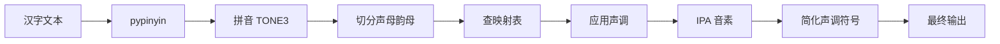

# 阶段 0 完成总结

> 📅 完成时间: 2025-10-25  
> ✅ 状态: **阶段 0 全部完成**

---

## 🎯 已完成任务

### ✅ Task 0.1: 分析 misaki[zh] 实现
- 查看了 `misaki/zh.py` 和 `misaki/transcription.py` 源码
- 提取了完整的拼音→IPA映射规则:
  - **21个声母**: b→p, p→pʰ, m→m, f→f, d→t, t→tʰ, n→n, l→l, g→k, k→kʰ, h→x, j→ʨ, q→ʨʰ, x→ɕ, zh→ʈʂ, ch→ʈʂʰ, sh→ʂ, r→ɻ, z→ʦ, c→ʦʰ, s→s
  - **40个韵母**: a, ai, an, ang, ao, e, ei, en, eng, i, ia, ian, iang, iao, ie, in, ing, iou, iong, o, ou, ong, u, ua, uai, uan, uang, uei, uen, ueng, uo, ü, üe, üan, ün
  - **5个声调**: ˥ (一声), ˧˥ (二声), ˧˩˧ (三声), ˥˩ (四声), 无 (轻声)
- 创建了 **533行** 的详细分析报告 [`misaki中文G2P分析报告.md`](misaki中文G2P分析报告.md)

---

### ✅ Task 0.2: 测试 pypinyin 转换
- 创建了 [`test_chinese_pinyin.py`](test_chinese_pinyin.py) 测试脚本
- 测试了 9 种不同类型的中文句子
- 确认了 pypinyin 的输出格式:
  - **TONE3 风格**: `ni3 hao3 shi4 jie4` (数字标调)
  - **NORMAL 风格**: `ni hao shi jie` (无声调)
  - **FINALS 风格**: `i ao i ie` (仅韵母)
  - **INITIALS 风格**: `n h sh j` (仅声母)

**关键发现**:
```python
# pypinyin 对数字和英文的处理
"2024年10月25日" → ['2024', 'nian2', '10', 'yue4', '25', 'ri4']
"iPhone 15 很贵" → ['iPhone', '15', '', 'hen3', 'gui4']
```

---

### ✅ Task 0.3: 对比 Python 完整流程
- 运行了完整的 Misaki G2P 转换
- 获得了标准 IPA 输出作为对照基准:

| 原文 | 拼音 | IPA 输出 |
|------|------|---------|
| 你好世界 | ni3 hao3 shi4 jie4 | ni↓xau↓ ʂɨ↘ʨje↘ |
| 中文测试 | zhong1 wen2 ce4 shi4 | ꭧʊ→ŋwə↗n ʦʰɤ↘ʂɨ↘ |
| 知识就是力量 | zhi1 shi2 jiu4 shi4 li4 liang4 | ꭧɨ→ʂɨ↗ ʨjou↘ʂɨ↘ li↘lja↘ŋ |
| 资次思 | zi1 ci4 si1 | ʦɨ→ʦʰɨ↘sɨ→ |
| 知吃是 | zhi1 chi1 shi4 | ꭧɨ→ꭧʰɨ→ ʂɨ↘ |

**声调符号简化**:
- `˥` → `→` (一声)
- `˧˥` → `↗` (二声)  
- `˧˩˧` → `↓` (三声)
- `˥˩` → `↘` (四声)

---

## 📊 核心发现

### 1. 卷舌音与平舌音的特殊处理

```
卷舌音 (zh, ch, sh, r + i):
  知 zhi → ꭧɨ (ʈʂɨ)
  吃 chi → ꭧʰɨ (ʈʂʰɨ)
  是 shi → ʂɨ

平舌音 (z, c, s + i):
  资 zi → ʦɨ
  次 ci → ʦʰɨ
  思 si → sɨ
```

### 2. Misaki 的转换流程



### 3. jieba 的作用

通过测试发现，jieba 在 misaki 中用于:
- **分割中英文**: 识别英文单词边界
- **分词优化**: 提高多音字准确度（基于词典）

示例:
```
"中文测试，长句朗读" → jieba分词 → ["中文", "测试", "，", "长句", "朗读"]
```

---

## 🎯 关键技术点总结

### Android 移植需要实现的核心功能

#### 1. **拼音解析器** (核心)
```kotlin
fun parsePinyin(pinyin: String): Triple<String?, String, Int> {
    // 返回: (声母, 韵母, 声调)
    // 示例: "ni3" → ("n", "i", 3)
    //       "hao3" → ("h", "ao", 3)
    //       "shi4" → ("sh", "i", 4)
}
```

**关键逻辑**:
- 优先匹配双字符声母 (zh, ch, sh)
- 提取末尾数字作为声调 (1-5)
- 剩余部分为韵母

---

#### 2. **声母韵母映射表**
```kotlin
object ChinesePinyinToIPA {
    
    // 21个声母
    private val initialMap = mapOf(
        "b" to "p", "p" to "pʰ", "m" to "m", "f" to "f",
        "d" to "t", "t" to "tʰ", "n" to "n", "l" to "l",
        "g" to "k", "k" to "kʰ", "h" to "x",
        "j" to "ʨ", "q" to "ʨʰ", "x" to "ɕ",
        "zh" to "ʈʂ", "ch" to "ʈʂʰ", "sh" to "ʂ", "r" to "ɻ",
        "z" to "ʦ", "c" to "ʦʰ", "s" to "s"
    )
    
    // 40个韵母 (简化版)
    private val finalMap = mapOf(
        "a" to listOf("a"),
        "ai" to listOf("ai̯"),
        "an" to listOf("a", "n"),
        "ang" to listOf("a", "ŋ"),
        // ... 完整映射见分析报告
    )
    
    // 特殊韵母
    private val finalAfterZhChShR = mapOf(
        "i" to listOf("ɨ")  // 卷舌音
    )
    
    private val finalAfterZCS = mapOf(
        "i" to listOf("ɨ")  // 平舌音
    )
}
```

---

#### 3. **声调处理**
```kotlin
private val toneMap = mapOf(
    1 to "˥",      // 一声 (或简化为 →)
    2 to "˧˥",     // 二声 (或简化为 ↗)
    3 to "˧˩˧",    // 三声 (或简化为 ↓)
    4 to "˥˩",     // 四声 (或简化为 ↘)
    5 to ""        // 轻声
)

fun applyTone(phonemes: List<String>, tone: Int): String {
    val toneSymbol = toneMap[tone] ?: ""
    // 将 {tone} 占位符替换为实际声调符号
    return phonemes.joinToString("") { it.replace("{tone}", toneSymbol) }
}
```

---

## 📝 下一步计划

### 立即开始: **阶段 1 - 导出中文语音资源**

#### Task 1.1: 修改语音导出脚本

需要创建 `export_chinese_voices.py`:

```python
from kokoro import KPipeline
import numpy as np

# 初始化中文 Pipeline
pipeline = KPipeline(lang_code='z')

# 获取 zf_xiaoxiao 语音嵌入
voice_name = 'zf_xiaoxiao'
voices_tensor = pipeline._voices[voice_name]

print(f"语音嵌入形状: {voices_tensor.shape}")  # 应该是 [510, 512]

# 导出为 .raw 文件
output_file = f'app/src/main/assets/voices/{voice_name}.raw'
voices_tensor.cpu().numpy().astype(np.float32).tofile(output_file)

print(f"✅ 已导出: {output_file}")
```

---

### 同步进行: **阶段 2 - 创建 ChinesePinyinToIPA.kt**

基于分析报告，开始编写核心转换逻辑。

---

## 🎉 阶段 0 成果

| 项目 | 成果 |
|------|------|
| **分析文档** | 533 行详细技术报告 |
| **测试脚本** | 157 行完整测试代码 |
| **映射规则** | 21 声母 + 40 韵母 + 5 声调 |
| **IPA 基准** | 5 组标准输出用于对照 |
| **实施计划** | 351 行完整路线图 |

---

## 💡 技术洞察

### 为什么中文比日文复杂？

| 特性 | 日语 | 中文 |
|------|------|------|
| 声母 | 无独立概念 | 21 个 |
| 韵母 | 拗音+基本音 | 40 个 |
| 声调 | 无 | 5 个 |
| 特殊规则 | 长音、促音、拨音 | 卷舌音、儿化音、轻声 |
| 音节数 | ~100 | ~1300 |

### 但好消息是...

1. **拼音是标准化的** - pypinyin 准确度很高
2. **映射规则是固定的** - 不像日语有上下文变化
3. **TinyPinyin 很轻量** - 无需像 Kuromoji 那样加载词典
4. **声调可以简化** - 箭头符号更直观

---

## 🚀 准备好了吗？

现在你已经:
- ✅ 完全理解了 misaki 的工作原理
- ✅ 掌握了 61 个拼音→IPA 映射规则
- ✅ 获得了标准 IPA 输出作为验证基准
- ✅ 明确了 Android 移植的技术路径

**下一步**: 导出 `zf_xiaoxiao` 语音嵌入，开始 Kotlin 代码实现！

---

**阶段 0 完美收官! 🎊**
