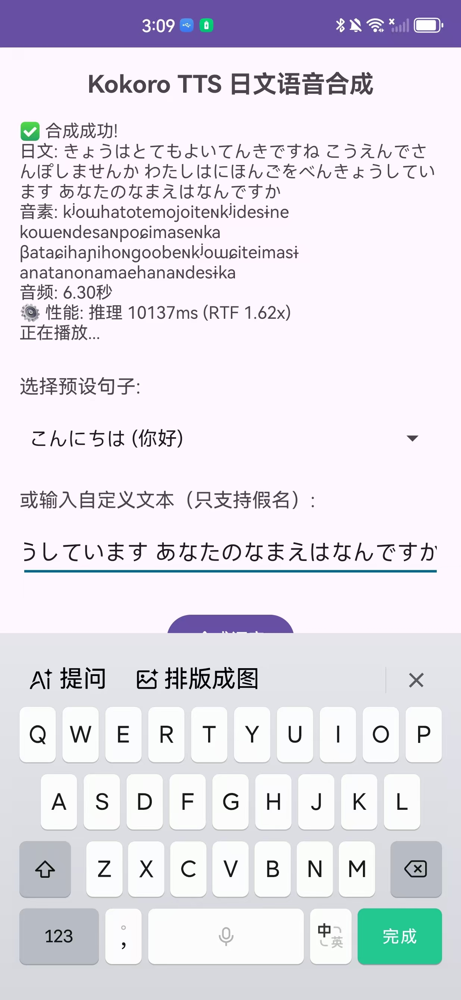

# 把 82M 参数的日语 TTS 模型搬到 Android 上？我失败了，但学到了很多

## 前言

最近折腾了一个周末，尝试把 Kokoro-82M 日语语音合成模型部署到 Android 手机上。结果嘛...一言难尽。

**TL;DR**: 功能跑通了，但性能和音质都不行，不适合实用。不过过程中踩了不少坑，记录下来供大家参考。



*看图说话：6 秒音频，推理 10 秒，RTF 1.62x，凉透了*

---

## 一、项目背景

### 为什么要做这个？

看到 Kokoro-82M 这个开源日语 TTS 模型，在 PC 上效果很不错：
- 音质自然
- 支持多种音色
- 完全本地运行

就想着：**能不能移植到手机上？** 这样就能做一个完全离线的日语语音合成 App。

### 技术栈

- **模型**: Kokoro-82M (82M 参数，PyTorch)
- **目标**: Android 端运行
- **方案**: PyTorch → ONNX → ONNX Runtime Mobile

看起来很简单对吧？实际上坑多着呢。

---

## 二、技术路线

### 第一步：ONNX 导出

这一步相对顺利。使用 `torch.onnx.export` 把 PyTorch 模型导出为 ONNX 格式。

**关键点**：
```python
torch.onnx.export(
    model,
    (tokens, voice_embedding, speed),
    "kokoro_latest.onnx",
    input_names=["input_ids", "ref_s", "speed"],
    output_names=["waveform"],
    dynamic_axes={
        "input_ids": {1: "seq_len"},
        "waveform": {1: "audio_len"}
    },
    opset_version=17
)
```

**坑点 1**: 语音嵌入必须用真实数据，随机生成的会导致输出噪音。

**结果**: 
- ✅ 导出成功
- ✅ 模型大小 310MB (FP32)
- ⚠️ 音质比原版低沉浑厚（问题的开始）

---

### 第二步：模型量化

310MB 对手机来说太大了，尝试量化压缩。

#### 方案 A: INT8 动态量化

```python
from onnxruntime.quantization import quantize_dynamic

quantize_dynamic(
    model_input="kokoro_latest.onnx",
    model_output="kokoro_latest_int8.onnx",
    weight_type=QuantType.QInt8
)
```

**结果**:
- ✅ 成功压缩到 109MB (减少 65%)
- ❌ **致命问题**: Android 端加载报错

```
Error: Could not find an implementation for ConvInteger(10)
```

**原因**: ONNX Runtime Android 版不支持 ConvInteger 算子！

#### 方案 B: FP16 转换

```python
from onnxconverter_common import float16

model_fp16 = float16.convert_float_to_float16(model)
```

**结果**:
- ✅ 压缩到 155MB
- ❌ **类型错误**: `tensor(float16) vs tensor(float)` 不匹配

#### 方案 C: 用回 FP32

没办法，只能用原始的 310MB FP32 模型。

**教训**: 移动端量化需要提前验证算子兼容性！

---

### 第三步：Android 集成

#### 3.1 ONNX Runtime 集成

```kotlin
// build.gradle.kts
implementation("ai.onnxruntime:onnxruntime-android:1.17.1")
```

**坑点 2**: 模型文件需要从 assets 复制到缓存目录才能加载。

```kotlin
val modelFile = File(context.cacheDir, modelName)
context.assets.open(modelName).use { input ->
    modelFile.outputStream().use { output ->
        input.copyTo(output)
    }
}
```

#### 3.2 NNAPI 硬件加速

本以为高通芯片的 NNAPI 能救场：

```kotlin
sessionOptions.addNnapi()
```

**结果**: 
```
NNAPI 支持 233/3348 节点 (7%)
```

只有 7% 的算子被硬件加速，93% 还是 CPU 计算！

**教训**: 不要迷信硬件加速，大模型在移动端的支持度很有限。

---

### 第四步：G2P 问题

Kokoro 需要把日文文本转换成音素，PC 端用的是 MeCab + UniDic。

但 MeCab 是 C++ 库，集成到 Android 太重了。

**妥协方案**: 基于规则的假名到音素映射表

```kotlin
private val hiraganaToPhoneme = mapOf(
    "あ" to "a", "い" to "i", "う" to "ɯ",
    "か" to "ka", "き" to "kʲi", "く" to "kɯ",
    // ... 200+ 条映射
)
```

**限制**:
- ✅ 无需外部依赖
- ❌ 只支持假名输入（不支持汉字）
- ❌ 准确度不如 MeCab

---

## 三、最终结果

### 性能数据（真实测试）

**测试环境**:
- 设备: 华为 RTE-AL00 (Android 12)
- 芯片: 高通 (支持 NNAPI)
- 模型: FP32 (310MB)

**性能表现**:

| 音频时长 | 推理时间 | RTF |
|---------|---------|-----|
| 2-3 秒 | 1-2 秒 | ~0.8x |
| 6-7 秒 | 10 秒 | ~1.6x |

**RTF (Real-Time Factor)**: 
- < 1.0 表示实时
- 1.6x 表示比实时慢 60%

### 问题汇总

#### 1. 性能问题 ❌ (严重)

- 6 秒音频需要 10 秒推理
- 完全无法实时合成
- NNAPI 加速效果微乎其微

#### 2. 音质问题 ❌ (严重)

- ONNX 版本声音低沉浑厚
- 和 PyTorch 原版差异明显
- 原因不明（可能是导出精度问题）

#### 3. 功能限制 ⚠️ (中等)

- 只支持假名输入
- 不支持汉字
- G2P 准确度一般

---

## 四、技术总结

### ✅ 成功的部分

1. **ONNX 导出流程** - 完整可复现
2. **Android 集成** - 功能跑通，能出声
3. **简化 G2P** - 轻量级方案，无需重型依赖
4. **完整代码** - 开源在 GitHub，供参考

### ❌ 失败的部分

1. **INT8 量化** - ConvInteger 算子不兼容
2. **FP16 转换** - 类型不匹配错误
3. **实时性** - RTF 1.6x，无法实用
4. **音质** - ONNX 和 PyTorch 差异大

### 💡 经验教训

1. **移动端模型要小** - 82M 参数太大了，即使是旗舰机也吃力
2. **算子兼容性优先** - 量化前先验证运行时支持
3. **硬件加速别迷信** - NNAPI 对大模型支持有限
4. **音质问题难调** - ONNX 导出的精度损失不好解决
5. **妥协是必要的** - 移动端要接受功能和性能的取舍

---

## 五、为什么要分享失败？

很多技术文章只写成功案例，但我觉得**失败的经验更有价值**：

1. **避免重复踩坑** - 有人想做类似项目，看到这篇就知道难点在哪
2. **真实的技术探索** - 不是所有想法都能成功，失败也是过程
3. **节省时间** - 别人不用再花几天时间走我走过的弯路

这个项目虽然失败了，但：
- ✅ 验证了技术路线（ONNX 可以导出）
- ✅ 发现了瓶颈（性能和音质）
- ✅ 积累了经验（量化、算子兼容性）

---

## 六、未来方向（如果要继续）

如果真的想把 TTS 模型搬到手机上，可能的方向：

1. **用更小的模型**
   - Kokoro-82M 太大，试试 10M-30M 的小模型
   - 或者自己蒸馏一个轻量版

2. **优化 ONNX 导出**
   - 研究音质问题的根源
   - 可能需要调整导出参数或后处理

3. **尝试其他框架**
   - TensorFlow Lite
   - MNN / NCNN (国产推理框架)
   - 可能对算子支持更好

4. **妥协方案**
   - 服务器端推理 + 客户端播放
   - 预生成常用句子
   - 降低采样率和音质

---

## 七、项目开源

完整代码已开源：
- **GitHub**: https://github.com/lemonhall/kokoro-ja-demo
- **包含内容**：
  - ONNX 导出脚本
  - INT8/FP16 量化工具
  - 完整 Android 应用
  - 简化 G2P 转换器
  - 性能测试数据
- **项目状态**: 技术验证阶段，不适合生产环境

**如果你要尝试类似项目**，建议：
1. 先在 PC 端验证 ONNX 音质
2. 提前测试量化算子兼容性
3. 准备好更多时间（比我估计的多 3 倍）
4. Fork 项目前先看 README 里的问题总结

---

## 八、最后

这次失败让我重新认识到：

> **移动端 AI 不是简单的"模型搬运"，而是一个需要权衡性能、音质、功能的系统工程。**

82M 参数的模型在 2024 年的中端手机上，依然是个挑战。

但失败不可怕，记录下来就是进步。

如果你也在做类似的事情，欢迎交流踩坑经验！

---

**附录：关键数据**

| 指标 | 数值 |
|------|------|
| 模型参数 | 82M |
| ONNX 模型大小 | 310MB (FP32) |
| INT8 量化后 | 109MB (不可用) |
| 推理时间 (6秒音频) | 10 秒 |
| RTF | 1.62x |
| NNAPI 支持率 | 7% (233/3348 节点) |
| 音质评价 | 比原版低沉 |
| 实用性评分 | 2/10 |

---

> **项目地址**: https://github.com/lemonhall/kokoro-ja-demo  
> 完整代码、详细文档和实测数据均已开源。  
> 失败也值得被记录。🎓
>
> **欢迎 Star 和交流踩坑经验！**
